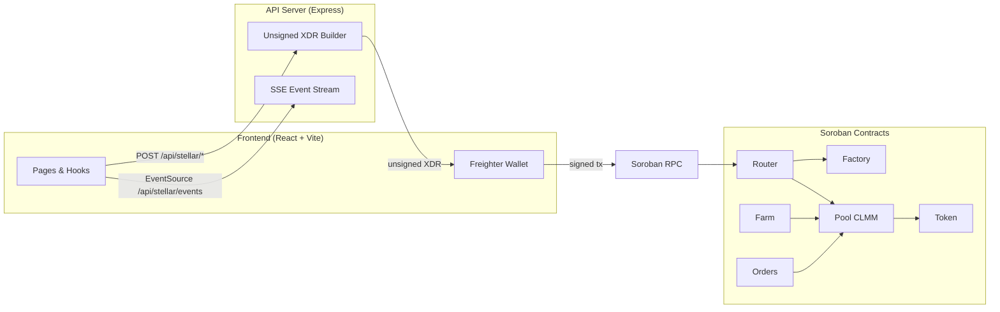

# Unicorn StelDex

A production-grade decentralized exchange on **Stellar Testnet** with real **Soroban smart contracts**: concentrated liquidity pools (Uniswap V3-style), veToken farming, limit orders, multi-hop routing, and Freighter wallet integration.

## Live Demo

| Resource | Link |
|----------|------|
| **Live App** | _Add Vercel URL after deploy_ |
| **GitHub Repo** | https://github.com/rhapy01/unicorn-steldex |
| **Submission Guide** | [docs/SUBMISSION.md](docs/SUBMISSION.md) |

## Deployed Contracts (Stellar Testnet)

| Contract | Address | Explorer |
|----------|---------|----------|
| Factory | `CCEWHLIJ4DN2C5T4HMYQQWN5J6REANDTH75P5ADETGQ5BZJG3YLISTVJ` | [View](https://stellar.expert/explorer/testnet/contract/CCEWHLIJ4DN2C5T4HMYQQWN5J6REANDTH75P5ADETGQ5BZJG3YLISTVJ) |
| Router | `CAGSKATNIUPSKGRVRH7KBTU7XITHYTRFLY3AW56S4TMZMIZ3OVCPTBFD` | [View](https://stellar.expert/explorer/testnet/contract/CAGSKATNIUPSKGRVRH7KBTU7XITHYTRFLY3AW56S4TMZMIZ3OVCPTBFD) |
| Farm | `CAKFQ22D3IOLNGVLIDBW5SOVH63D2YUENYSAGXPYD2YDLTP2L32CCFZD` | [View](https://stellar.expert/explorer/testnet/contract/CAKFQ22D3IOLNGVLIDBW5SOVH63D2YUENYSAGXPYD2YDLTP2L32CCFZD) |
| Orders | `CASLA3FDOK7L3A2XBDWNIKUPJGOLZBDITXWCU7TGDJWOPYHQ644UDV6H` | [View](https://stellar.expert/explorer/testnet/contract/CASLA3FDOK7L3A2XBDWNIKUPJGOLZBDITXWCU7TGDJWOPYHQ644UDV6H) |
| XLM/pUSDC Pool | `CD6QDXJ6HAUQ4PXYCU5FS5L5GZQ43TCNST7MR4VC5UWXM7AYZVE5GP5B` | [View](https://stellar.expert/explorer/testnet/contract/CD6QDXJ6HAUQ4PXYCU5FS5L5GZQ43TCNST7MR4VC5UWXM7AYZVE5GP5B) |
| XLM Token (SAC) | `CDLZFC3SYJYDZT7K67VZ75HPJVIEUVNIXF47ZG2FB2RMQQVU2HHGCYSC` | [View](https://stellar.expert/explorer/testnet/contract/CDLZFC3SYJYDZT7K67VZ75HPJVIEUVNIXF47ZG2FB2RMQQVU2HHGCYSC) |
| pUSDC Token | `CBJVNOPY4KCBUK6D27DKMTRDFAMR6K6J5EFO4DS2LOGI5N7WGFYFOSB4` | [View](https://stellar.expert/explorer/testnet/contract/CBJVNOPY4KCBUK6D27DKMTRDFAMR6K6J5EFO4DS2LOGI5N7WGFYFOSB4) |
| STELLAR Token | `CA2V6BTOFCL4OQOYGQQPGUO4PHUOSMH67HC363MXQKOHM2WTG4CGYND4` | [View](https://stellar.expert/explorer/testnet/contract/CA2V6BTOFCL4OQOYGQQPGUO4PHUOSMH67HC363MXQKOHM2WTG4CGYND4) |
| Circle USDC (cUSDC) | `CBIELTK6YBZJU5UP2WWQEUCYKLPU6AUNZ2BQ4WWFEIE3USCIHMXQDAMA` | [View](https://stellar.expert/explorer/testnet/contract/CBIELTK6YBZJU5UP2WWQEUCYKLPU6AUNZ2BQ4WWFEIE3USCIHMXQDAMA) |
| EURC Token | `CCUUDM434BMZMYWYDITHFXHDMIVTGGD6T2I5UKNX5BSLXLW7HVR4MCGZ` | [View](https://stellar.expert/explorer/testnet/contract/CCUUDM434BMZMYWYDITHFXHDMIVTGGD6T2I5UKNX5BSLXLW7HVR4MCGZ) |

**10 deployed pools:** XLM/pUSDC, XLM/cUSDC, EURC/XLM, STELLAR/XLM, cUSDC/pUSDC, EURC/pUSDC, STELLAR/pUSDC, EURC/cUSDC, STELLAR/cUSDC, EURC/STELLAR

**Sample transaction hash:** `_Execute an on-chain swap and paste the tx hash here_`

## Features

- **Swap** — XLM ↔ pUSDC ↔ cUSDC ↔ EURC ↔ STELLAR with slippage controls
- **Pools** — Concentrated liquidity (Uniswap V3-style CLMM) with tick ranges and fee tiers
- **Farm** — veToken model: lock LP up to 3 years for up to 2.5× reward boost
- **Limit Orders** — Resting on-chain orders with IOC fill, expiry, and keeper bot
- **Portfolio** — Live Horizon balances, LP positions, and recent transaction history
- **Activity** — Real-time transaction feed via Server-Sent Events
- **Create Pool** — Deploy new CLMM pools via the factory contract from the UI

## Architecture



### Key design decisions

1. **Unsigned XDR pattern** — API builds transactions; Freighter signs client-side; private keys never leave the browser.
2. **Inter-contract communication** — Router calls Factory and Pool; Farm reads Pool LP positions; Orders contract executes swaps through Pool.
3. **Event streaming** — Soroban contract events polled via Horizon; exposed as SSE at `/api/stellar/events` for live UI updates.
4. **On-chain mode** — No database required; all data sourced from Soroban RPC and Horizon.

## Tech Stack

| Layer | Technology |
|-------|------------|
| Smart Contracts | Rust, Soroban SDK 22, WASM |
| Frontend | React 19, Vite 7, Tailwind CSS 4, shadcn/ui, TanStack Query |
| API | Express 5, TypeScript, Zod validation, OpenAPI codegen |
| Wallet | Freighter browser extension |
| CI/CD | GitHub Actions |
| Deploy | Vercel (frontend + API serverless) |

## Quick Start

### Prerequisites

- Node.js 22+
- Rust + `wasm32-unknown-unknown` target (for contract builds only)
- [Freighter wallet](https://www.freighter.app/) browser extension

### Install & run

```bash
# Clone
git clone https://github.com/rhapy01/unicorn-steldex.git
cd unicorn-steldex

# Install (use npx pnpm on Windows if pnpm not in PATH)
npx pnpm install

# Start both API (port 8080) and frontend (port 5000)
npx pnpm dev
```

### Run tests

```bash
npx pnpm test                                        # all tests
npx pnpm --filter @workspace/stellar-dex run test    # frontend unit tests
npx pnpm --filter @workspace/api-server run test     # API integration tests
cd contracts && cargo test --workspace               # Soroban contract tests
```

### Deploy to Stellar Testnet

```bash
# Build WASM contracts
./contracts/build.sh

# Deploy (fund your key at https://laboratory.stellar.org first)
DEPLOYER_SECRET_KEY=S... npx pnpm --filter @workspace/scripts run deploy
```

### Build for production

```bash
npx pnpm run build
```

## Project Structure

```
contracts/            # 5 Soroban smart contracts (Rust/WASM)
  token/              # SEP-41 fungible token
  factory/            # CLMM pool factory
  pool/               # Concentrated liquidity pool (Uniswap V3-style)
  router/             # Multi-hop swap router
  farm/               # veToken yield farming
  orders/             # On-chain limit/stop orders
artifacts/
  stellar-dex/        # React 19 frontend (Vite)
  api-server/         # Express 5 API + Soroban XDR builders
lib/
  api-spec/           # OpenAPI 3.1 source of truth
  api-zod/            # Generated Zod request/response schemas
  api-client-react/   # Generated TanStack Query hooks
  db/                 # Drizzle ORM schema (optional DB mode)
scripts/              # Deployment, seeding, and test scripts
docs/                 # Submission guide and screenshots
.github/workflows/    # CI/CD pipeline
```

## CI/CD

GitHub Actions runs on every push to `main`:

- **TypeScript & Tests** — typecheck + frontend vitest + API supertest
- **Soroban Contracts** — `cargo test --workspace`

See [`.github/workflows/ci.yml`](.github/workflows/ci.yml).

## Submission Checklist

| Requirement | Status |
|-------------|--------|
| Public GitHub repository | ✅ https://github.com/rhapy01/unicorn-steldex |
| README with complete documentation | ✅ This file |
| 10+ meaningful commits | ✅ |
| CI/CD pipeline (GitHub Actions) | ✅ `.github/workflows/ci.yml` |
| Tests (3+ passing) | ✅ 20+ tests — `npx pnpm test` |
| Smart contracts (Soroban WASM) | ✅ 5 contracts in `contracts/` |
| Inter-contract communication | ✅ Router→Factory→Pool, Farm→Pool, Orders→Pool |
| Event streaming (SSE) | ✅ `/api/stellar/events` + Activity page |
| Mobile responsive UI | ✅ Sheet nav + responsive grids |
| Error handling & loading states | ✅ Skeletons, toasts, error boundary |
| Deployment script | ✅ `scripts/src/deploy-contracts.ts` |
| Contract addresses | ✅ See table above |
| Live demo link | ⬜ Add after Vercel deploy |
| Transaction hash | ⬜ Execute on-chain swap, paste above |
| Screenshots | ⬜ Add to `docs/screenshots/` |

## License

MIT
