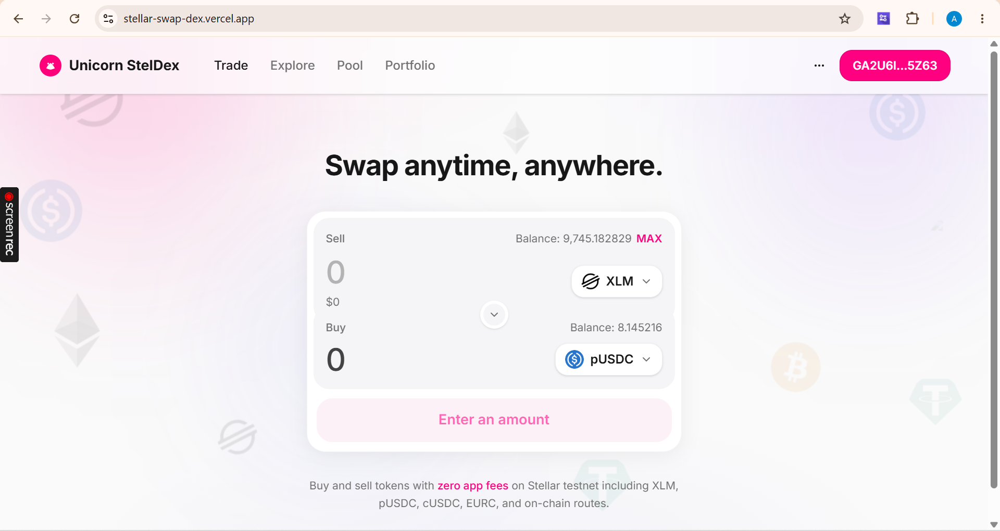
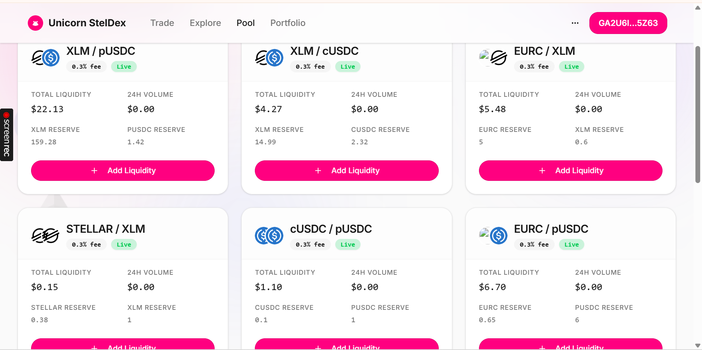
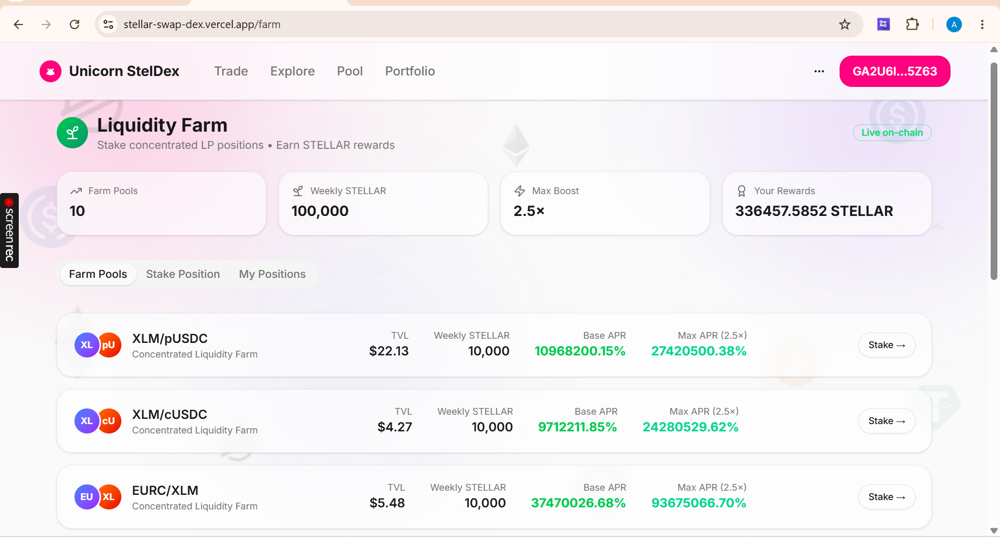
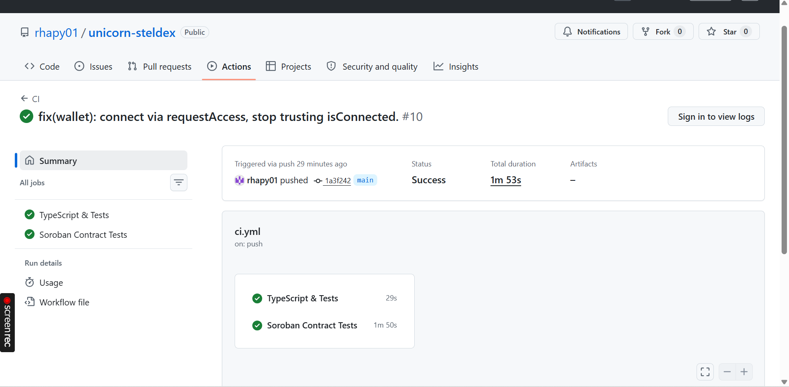

# Unicorn StelDex

A production-grade decentralized exchange on **Stellar Testnet** built with real **Soroban smart contracts**: concentrated liquidity pools (Uniswap V3-style CLMM), veToken farming, on-chain limit orders, multi-hop routing, and **Freighter wallet integration**.

> **This is a pnpm monorepo.** The frontend and API live under `artifacts/`, not the repo root. Smart contracts live under `contracts/`. Shared libraries live under `lib/`. If you are reviewing or verifying this project, use the navigation tables below — they point to every requirement and where it lives in the tree.

---

## For assessors & verifiers — start here

| What you are looking for | Where to find it |
|--------------------------|------------------|
| **Live deployed app** | https://stellar-swap-dex.vercel.app |
| **Public GitHub repo** | https://github.com/rhapy01/unicorn-steldex |
| **CI pipeline (green runs)** | [`.github/workflows/ci.yml`](.github/workflows/ci.yml) · [Actions tab](https://github.com/rhapy01/unicorn-steldex/actions) |
| **Run all tests locally** | `npx pnpm test` (root `package.json`) + `cd contracts && cargo test --workspace` |
| **Frontend app (React)** | [`artifacts/stellar-dex/`](artifacts/stellar-dex/) |
| **API server (Express)** | [`artifacts/api-server/`](artifacts/api-server/) |
| **Soroban contracts (Rust)** | [`contracts/`](contracts/) — 6 crates: `token`, `factory`, `pool`, `router`, `farm`, `orders` |
| **Wallet integration (Freighter)** | [`artifacts/stellar-dex/src/hooks/use-wallet.tsx`](artifacts/stellar-dex/src/hooks/use-wallet.tsx) |
| **On-chain tx signing flow** | [`artifacts/stellar-dex/src/hooks/use-stellar.ts`](artifacts/stellar-dex/src/hooks/use-stellar.ts) |
| **Soroban XDR builders (API)** | [`artifacts/api-server/src/routes/stellar.ts`](artifacts/api-server/src/routes/stellar.ts) |
| **Deployed contract addresses** | Table below · also `GET /api/stellar/contracts` on live app |
| **Contract env config (code)** | [`artifacts/api-server/src/lib/contract-config.ts`](artifacts/api-server/src/lib/contract-config.ts) |
| **Contract env file (local)** | `.env.contracts` at repo root (gitignored; values mirrored in README + Vercel env) |
| **Vercel deployment config** | [`vercel.json`](vercel.json) + [`api/index.mjs`](api/index.mjs) |
| **OpenAPI spec** | [`lib/api-spec/openapi.yaml`](lib/api-spec/openapi.yaml) |
| **Generated API types / client** | [`lib/api-zod/`](lib/api-zod/) · [`lib/api-client-react/`](lib/api-client-react/) |
| **Deployment scripts** | [`scripts/src/`](scripts/src/) — `deploy-contracts.ts`, `redeploy-orders.ts`, etc. |
| **External integration (chat / other apps)** | [`docs/INTEGRATION.md`](docs/INTEGRATION.md) |
| **Submission checklist (extra)** | [`docs/SUBMISSION.md`](docs/SUBMISSION.md) |
| **Screenshots** | [`artifacts/stellar-dex/screenshot/`](artifacts/stellar-dex/screenshot/) |
| **Demo video** | https://youtu.be/o9YQXTY5A_U |
| **Sample on-chain tx hash** | _Paste swap tx hash in section below if not already in video_ |

---

## Live demo

| Resource | Link |
|----------|------|
| **Live App** | https://stellar-swap-dex.vercel.app |
| **GitHub Repo** | https://github.com/rhapy01/unicorn-steldex |
| **Demo video** | https://youtu.be/o9YQXTY5A_U |
| **CI Actions** | https://github.com/rhapy01/unicorn-steldex/actions |
| **Latest green CI run** | https://github.com/rhapy01/unicorn-steldex/actions/runs/28709392382 |
| **Deployer account (testnet)** | [GC6Y34Q5… on Stellar Expert](https://stellar.expert/explorer/testnet/account/GC6Y34Q5VWMHL3N2GUVY7HDQUCYLEJLRNSPYV6A4BS5JNKRUVOLZZBCI) |

**Sample transaction hash (contract interaction):** _Paste a swap tx hash from the demo (Stellar Expert or Freighter history)._

### Screenshots

Folder: [`artifacts/stellar-dex/screenshot/`](artifacts/stellar-dex/screenshot/)

| Screen | File |
|--------|------|
| Swap (wallet connected) | [`swap-wallet-connected.png`](artifacts/stellar-dex/screenshot/swap-wallet-connected.png) |
| Liquidity pools | [`pools.png`](artifacts/stellar-dex/screenshot/pools.png) |
| Liquidity farm | [`farm.png`](artifacts/stellar-dex/screenshot/farm.png) |
| Green CI pipeline | [`ci-pipeline.png`](artifacts/stellar-dex/screenshot/ci-pipeline.png) |









---

## UI pages → source files

The React app is **not** at the repo root. It is in `artifacts/stellar-dex/`. Routes are defined in [`artifacts/stellar-dex/src/App.tsx`](artifacts/stellar-dex/src/App.tsx).

| Live URL path | Feature | Source file |
|---------------|---------|-------------|
| `/` | Swap (on-chain) | [`artifacts/stellar-dex/src/pages/swap.tsx`](artifacts/stellar-dex/src/pages/swap.tsx) |
| `/explore` | Market explore | [`artifacts/stellar-dex/src/pages/explore.tsx`](artifacts/stellar-dex/src/pages/explore.tsx) |
| `/pool` | Add / remove liquidity | [`artifacts/stellar-dex/src/pages/pools.tsx`](artifacts/stellar-dex/src/pages/pools.tsx) |
| `/farm` | Stake LP, claim rewards | [`artifacts/stellar-dex/src/pages/farm.tsx`](artifacts/stellar-dex/src/pages/farm.tsx) |
| `/orders` | Limit / stop / take-profit orders | [`artifacts/stellar-dex/src/pages/limit-orders.tsx`](artifacts/stellar-dex/src/pages/limit-orders.tsx) |
| `/portfolio` | Balances & LP positions | [`artifacts/stellar-dex/src/pages/portfolio.tsx`](artifacts/stellar-dex/src/pages/portfolio.tsx) |
| `/transactions` | Live on-chain activity (SSE) | [`artifacts/stellar-dex/src/pages/transactions.tsx`](artifacts/stellar-dex/src/pages/transactions.tsx) |

**Supporting frontend hooks (easy to miss):**

| Hook / lib | Purpose | Path |
|------------|---------|------|
| `useWallet()` | Freighter connect, address, sign | [`artifacts/stellar-dex/src/hooks/use-wallet.ts`](artifacts/stellar-dex/src/hooks/use-wallet.ts) |
| `useStellarContract()` | Multi-step on-chain ops | [`artifacts/stellar-dex/src/hooks/use-stellar.ts`](artifacts/stellar-dex/src/hooks/use-stellar.ts) |
| `useLimitOrders()` | Order book + wallet orders | [`artifacts/stellar-dex/src/hooks/use-limit-orders.ts`](artifacts/stellar-dex/src/hooks/use-limit-orders.ts) |
| `useStellarEvents()` | SSE event stream | [`artifacts/stellar-dex/src/hooks/use-stellar-events.ts`](artifacts/stellar-dex/src/hooks/use-stellar-events.ts) |
| `useTrustlines()` | Circle USDC/EURC trustlines | [`artifacts/stellar-dex/src/hooks/use-trustlines.ts`](artifacts/stellar-dex/src/hooks/use-trustlines.ts) |

---

## API routes → source files

The API mounts all routes under `/api` in [`artifacts/api-server/src/app.ts`](artifacts/api-server/src/app.ts). Route modules are registered in [`artifacts/api-server/src/routes/index.ts`](artifacts/api-server/src/routes/index.ts).

### On-chain / Soroban endpoints (main verification target)

All in [`artifacts/api-server/src/routes/stellar.ts`](artifacts/api-server/src/routes/stellar.ts):

| Method | Endpoint | Purpose |
|--------|----------|---------|
| `GET` | `/api/stellar/contracts` | Returns deployed contract addresses |
| `GET` | `/api/stellar/pools` | Lists factory pools on-chain |
| `GET` | `/api/stellar/pool-state?contract=C...` | Pool sqrt price, liquidity, ticks |
| `POST` | `/api/stellar/swap/quote` | On-chain swap simulation + slippage |
| `POST` | `/api/stellar/swap` | Build unsigned swap XDR (multi-step) |
| `POST` | `/api/stellar/add-liquidity` | Build unsigned mint XDR (multi-step) |
| `POST` | `/api/stellar/remove-liquidity` | Build unsigned burn XDR |
| `POST` | `/api/stellar/stake` | Farm stake XDR |
| `POST` | `/api/stellar/claim` | Farm claim XDR |
| `POST` | `/api/stellar/unstake` | Farm unstake XDR |
| `POST` | `/api/stellar/limit-order` | IOC fill or resting `place_order` XDR |
| `POST` | `/api/stellar/cancel-order` | Cancel resting order XDR |
| `GET` | `/api/stellar/orders?wallet=G...` | Wallet's on-chain orders |
| `GET` | `/api/stellar/order-book?pool=C...&from=XLM&to=pUSDC` | Aggregated order book |
| `GET` | `/api/stellar/keeper-tick` | Order keeper (cron / manual fill) |
| `GET` | `/api/stellar/farm-stats` | Farm emissions overview |
| `GET` | `/api/stellar/farm-pools` | Farm pool list |
| `GET` | `/api/stellar/farm-positions?wallet=G...` | User farm positions |
| `POST` | `/api/stellar/create-pool` | Factory create-pool XDR |
| `POST` | `/api/stellar/mint-test-tokens` | Testnet pUSDC/STELLAR mint helper |

### Event streaming

| Method | Endpoint | Source |
|--------|----------|--------|
| `GET` | `/api/stellar/events` | [`artifacts/api-server/src/routes/events.ts`](artifacts/api-server/src/routes/events.ts) |

### Demo / catalog API (Postgres-backed fallbacks)

| Method | Endpoint | Source |
|--------|----------|--------|
| `GET` | `/api/healthz` | [`artifacts/api-server/src/routes/health.ts`](artifacts/api-server/src/routes/health.ts) |
| `GET` | `/api/tokens` | [`artifacts/api-server/src/routes/tokens.ts`](artifacts/api-server/src/routes/tokens.ts) |
| `GET` | `/api/pools` | [`artifacts/api-server/src/routes/pools.ts`](artifacts/api-server/src/routes/pools.ts) |
| `GET` | `/api/swap/quote` | [`artifacts/api-server/src/routes/swap.ts`](artifacts/api-server/src/routes/swap.ts) |
| `GET` | `/api/portfolio` | [`artifacts/api-server/src/routes/portfolio.ts`](artifacts/api-server/src/routes/portfolio.ts) |
| `GET` | `/api/transactions` | [`artifacts/api-server/src/routes/transactions.ts`](artifacts/api-server/src/routes/transactions.ts) |
| `GET` | `/api/market/stats` | [`artifacts/api-server/src/routes/market.ts`](artifacts/api-server/src/routes/market.ts) |

### On-chain helper libraries (not routes — easy to miss)

| File | Purpose |
|------|---------|
| [`artifacts/api-server/src/lib/on-chain-pools.ts`](artifacts/api-server/src/lib/on-chain-pools.ts) | Read pools from factory |
| [`artifacts/api-server/src/lib/on-chain-farm.ts`](artifacts/api-server/src/lib/on-chain-farm.ts) | Farm reads / positions |
| [`artifacts/api-server/src/lib/on-chain-orders.ts`](artifacts/api-server/src/lib/on-chain-orders.ts) | Order book, order parsing |
| [`artifacts/api-server/src/lib/order-keeper.ts`](artifacts/api-server/src/lib/order-keeper.ts) | Auto-fill resting orders |
| [`artifacts/api-server/src/lib/swap-sim.ts`](artifacts/api-server/src/lib/swap-sim.ts) | Soroban swap simulation |
| [`artifacts/api-server/src/lib/clmm-math.ts`](artifacts/api-server/src/lib/clmm-math.ts) | CLMM price / liquidity math |

---

## Smart contracts → source → deployment

All Soroban contracts are Rust crates under [`contracts/`](contracts/). Build with [`contracts/build.sh`](contracts/build.sh) or `cargo build --target wasm32-unknown-unknown --release` inside `contracts/`.

| Contract | Rust source | Key on-chain methods | Testnet address |
|----------|-------------|----------------------|-----------------|
| **Token** (SEP-41) | [`contracts/token/src/lib.rs`](contracts/token/src/lib.rs) | `transfer`, `approve`, `mint` | pUSDC: `CBJVNOPY4KCBUK6D27DKMTRDFAMR6K6J5EFO4DS2LOGI5N7WGFYFOSB4` |
| **Factory** | [`contracts/factory/src/lib.rs`](contracts/factory/src/lib.rs) | `create_pool`, `get_pool` | `CCEWHLIJ4DN2C5T4HMYQQWN5J6REANDTH75P5ADETGQ5BZJG3YLISTVJ` |
| **Pool** (CLMM) | [`contracts/pool/src/lib.rs`](contracts/pool/src/lib.rs) | `swap`, `mint`, `burn`, `sqrt_price` | XLM/pUSDC: `CD6QDXJ6HAUQ4PXYCU5FS5L5GZQ43TCNST7MR4VC5UWXM7AYZVE5GP5B` |
| **Router** | [`contracts/router/src/lib.rs`](contracts/router/src/lib.rs) | `swap`, `add_liquidity` | `CAGSKATNIUPSKGRVRH7KBTU7XITHYTRFLY3AW56S4TMZMIZ3OVCPTBFD` |
| **Farm** (veToken) | [`contracts/farm/src/lib.rs`](contracts/farm/src/lib.rs) | `stake`, `claim`, `unstake` | `CAKFQ22D3IOLNGVLIDBW5SOVH63D2YUENYSAGXPYD2YDLTP2L32CCFZD` |
| **Orders** | [`contracts/orders/src/lib.rs`](contracts/orders/src/lib.rs) | `place_order`, `fill_order`, `cancel_order` | `CASLA3FDOK7L3A2XBDWNIKUPJGOLZBDITXWCU7TGDJWOPYHQ644UDV6H` |

### Inter-contract communication

```
Router.swap()   → Factory.get_pool() → Pool.swap()
Farm.stake()    → Pool.get_position()
Orders.fill_order() → Token.approve() → Pool.swap() → Token.transfer()
```

**Router source:** [`contracts/router/src/lib.rs`](contracts/router/src/lib.rs)

### All deployed addresses (Stellar Testnet)

| Contract / asset | Address | Explorer |
|------------------|---------|----------|
| **Factory** | `CCEWHLIJ4DN2C5T4HMYQQWN5J6REANDTH75P5ADETGQ5BZJG3YLISTVJ` | [View](https://stellar.expert/explorer/testnet/contract/CCEWHLIJ4DN2C5T4HMYQQWN5J6REANDTH75P5ADETGQ5BZJG3YLISTVJ) |
| **Router** | `CAGSKATNIUPSKGRVRH7KBTU7XITHYTRFLY3AW56S4TMZMIZ3OVCPTBFD` | [View](https://stellar.expert/explorer/testnet/contract/CAGSKATNIUPSKGRVRH7KBTU7XITHYTRFLY3AW56S4TMZMIZ3OVCPTBFD) |
| **Farm** | `CAKFQ22D3IOLNGVLIDBW5SOVH63D2YUENYSAGXPYD2YDLTP2L32CCFZD` | [View](https://stellar.expert/explorer/testnet/contract/CAKFQ22D3IOLNGVLIDBW5SOVH63D2YUENYSAGXPYD2YDLTP2L32CCFZD) |
| **Orders** | `CASLA3FDOK7L3A2XBDWNIKUPJGOLZBDITXWCU7TGDJWOPYHQ644UDV6H` | [View](https://stellar.expert/explorer/testnet/contract/CASLA3FDOK7L3A2XBDWNIKUPJGOLZBDITXWCU7TGDJWOPYHQ644UDV6H) |
| **XLM/pUSDC Pool** | `CD6QDXJ6HAUQ4PXYCU5FS5L5GZQ43TCNST7MR4VC5UWXM7AYZVE5GP5B` | [View](https://stellar.expert/explorer/testnet/contract/CD6QDXJ6HAUQ4PXYCU5FS5L5GZQ43TCNST7MR4VC5UWXM7AYZVE5GP5B) |
| **XLM/cUSDC Pool** | `CDJH3ORUUPC7GFV5UDCZE4UU4ZDZAO2X73AOHP7BMXADV7ER3OLLDGXU` | [View](https://stellar.expert/explorer/testnet/contract/CDJH3ORUUPC7GFV5UDCZE4UU4ZDZAO2X73AOHP7BMXADV7ER3OLLDGXU) |
| **EURC/XLM Pool** | `CBJOKMRM54Y2T4MHD7OECFTZR2RPPXF2NW7LZYGQBOMV5FCLKFYLFWLR` | [View](https://stellar.expert/explorer/testnet/contract/CBJOKMRM54Y2T4MHD7OECFTZR2RPPXF2NW7LZYGQBOMV5FCLKFYLFWLR) |
| **STELLAR/XLM Pool** | `CCAQL2EQLQVGVAMPA42THBJJ3BB6PVUEUKEC2TMK3U7FUEOFI6BBPJZQ` | [View](https://stellar.expert/explorer/testnet/contract/CCAQL2EQLQVGVAMPA42THBJJ3BB6PVUEUKEC2TMK3U7FUEOFI6BBPJZQ) |
| **XLM SAC** | `CDLZFC3SYJYDZT7K67VZ75HPJVIEUVNIXF47ZG2FB2RMQQVU2HHGCYSC` | [View](https://stellar.expert/explorer/testnet/contract/CDLZFC3SYJYDZT7K67VZ75HPJVIEUVNIXF47ZG2FB2RMQQVU2HHGCYSC) |
| **pUSDC** | `CBJVNOPY4KCBUK6D27DKMTRDFAMR6K6J5EFO4DS2LOGI5N7WGFYFOSB4` | [View](https://stellar.expert/explorer/testnet/contract/CBJVNOPY4KCBUK6D27DKMTRDFAMR6K6J5EFO4DS2LOGI5N7WGFYFOSB4) |
| **STELLAR** | `CA2V6BTOFCL4OQOYGQQPGUO4PHUOSMH67HC363MXQKOHM2WTG4CGYND4` | [View](https://stellar.expert/explorer/testnet/contract/CA2V6BTOFCL4OQOYGQQPGUO4PHUOSMH67HC363MXQKOHM2WTG4CGYND4) |
| **Circle cUSDC** | `CBIELTK6YBZJU5UP2WWQEUCYKLPU6AUNZ2BQ4WWFEIE3USCIHMXQDAMA` | [View](https://stellar.expert/explorer/testnet/contract/CBIELTK6YBZJU5UP2WWQEUCYKLPU6AUNZ2BQ4WWFEIE3USCIHMXQDAMA) |
| **EURC** | `CCUUDM434BMZMYWYDITHFXHDMIVTGGD6T2I5UKNX5BSLXLW7HVR4MCGZ` | [View](https://stellar.expert/explorer/testnet/contract/CCUUDM434BMZMYWYDITHFXHDMIVTGGD6T2I5UKNX5BSLXLW7HVR4MCGZ) |

**Deployer public key:** `GC6Y34Q5VWMHL3N2GUVY7HDQUCYLEJLRNSPYV6A4BS5JNKRUVOLZZBCI`  
**Deployment date:** June 11, 2026

---

## Tests — where they live and how to run them

### TypeScript / Vitest (20 tests)

```bash
npx pnpm test                              # all TS tests (root package.json)
npx pnpm --filter @workspace/stellar-dex run test   # 8 frontend tests
npx pnpm --filter @workspace/api-server run test    # 12 API tests
```

| Test file | What it covers |
|-----------|----------------|
| [`artifacts/stellar-dex/src/lib/format.test.ts`](artifacts/stellar-dex/src/lib/format.test.ts) | Token amount formatting |
| [`artifacts/api-server/src/routes/health.test.ts`](artifacts/api-server/src/routes/health.test.ts) | Health endpoint |
| [`artifacts/api-server/src/routes/stellar.test.ts`](artifacts/api-server/src/routes/stellar.test.ts) | Stellar route validation |
| [`artifacts/api-server/src/routes/events.test.ts`](artifacts/api-server/src/routes/events.test.ts) | SSE events stream |
| [`artifacts/api-server/src/lib/clmm-math.test.ts`](artifacts/api-server/src/lib/clmm-math.test.ts) | CLMM math unit tests |

API test setup (skips loading `.env.contracts` in CI): [`artifacts/api-server/src/vitest.setup.ts`](artifacts/api-server/src/vitest.setup.ts)

### Soroban / Rust (6 tests)

```bash
cd contracts && cargo test --workspace
```

| Crate | Test file | Tests |
|-------|-----------|-------|
| `token` | [`contracts/token/src/lib.rs`](contracts/token/src/lib.rs) | 4 unit tests (transfer, approve, mint) |
| `factory` | [`contracts/factory/src/lib.rs`](contracts/factory/src/lib.rs) | 2 unit tests (initialize, admin) |

Contract test snapshots: `contracts/*/test_snapshots/`

---

## CI/CD

**Workflow file:** [`.github/workflows/ci.yml`](.github/workflows/ci.yml)  
**Live runs:** https://github.com/rhapy01/unicorn-steldex/actions

On every push to `main`:

| Job | Steps |
|-----|-------|
| **TypeScript & Tests** | `pnpm install` → frontend vitest → API vitest → frontend build |
| **Soroban Contract Tests** | `cargo test --workspace` in `contracts/` |

---

## Deployment (Vercel)

Frontend + API are deployed together on Vercel (not separate hosts).

| File | Role |
|------|------|
| [`vercel.json`](vercel.json) | Build command, rewrites `/api/*` → serverless function, daily order-keeper cron |
| [`api/index.mjs`](api/index.mjs) | Vercel serverless entry → imports built Express app |
| [`artifacts/api-server/src/vercel.ts`](artifacts/api-server/src/vercel.ts) | Express app export for Vercel |
| [`artifacts/api-server/build.mjs`](artifacts/api-server/build.mjs) | esbuild bundle for serverless |
| [`artifacts/stellar-dex/`](artifacts/stellar-dex/) | Static frontend build output → `artifacts/stellar-dex/dist/public` |

**Environment variables** (set on Vercel; loaded locally from `.env.contracts` via [`artifacts/api-server/src/lib/load-env.ts`](artifacts/api-server/src/lib/load-env.ts)):

| Variable | Purpose |
|----------|---------|
| `FACTORY_CONTRACT` | Factory address |
| `ROUTER_CONTRACT` | Router address |
| `FARM_CONTRACT` | Farm address |
| `ORDERS_CONTRACT` | Limit-order book contract |
| `POOL_CONTRACT` | Primary pool (legacy single-pool ref) |
| `POOLS_JSON` | JSON map of all pool addresses by pair |
| `XLM_TOKEN_CONTRACT` | Wrapped XLM SAC |
| `USDC_TOKEN_CONTRACT` | Custom pUSDC |
| `CIRCLE_USDC_TOKEN_CONTRACT` | Circle cUSDC SAC |
| `EURC_TOKEN_CONTRACT` | EURC SAC |
| `STELLAR_TOKEN_CONTRACT` | Farm reward token |
| `DEPLOYER_SECRET_KEY` / `KEEPER_SECRET_KEY` | Testnet keeper + test mints (server only, never in frontend) |
| `DATABASE_URL` | Optional Postgres for demo catalog API |

Local env template: [`.env.example`](.env.example)

---

## Monorepo layout (pnpm workspace)

Workspace definition: [`pnpm-workspace.yaml`](pnpm-workspace.yaml)

```
unicorn-steldex/                    ← repo root (workspace root)
├── artifacts/
│   ├── stellar-dex/                ← @workspace/stellar-dex  — React 19 frontend
│   └── api-server/                 ← @workspace/api-server   — Express 5 API
├── contracts/                      ← Soroban Rust workspace (6 crates)
│   ├── token/ factory/ pool/ router/ farm/ orders/
│   └── build.sh                    ← WASM build script
├── lib/
│   ├── api-spec/                   ← @workspace/api-spec     — OpenAPI source
│   ├── api-zod/                    ← @workspace/api-zod      — generated Zod schemas
│   ├── api-client-react/           ← @workspace/api-client-react — generated hooks
│   └── db/                         ← @workspace/db           — Drizzle schema (optional)
├── scripts/                        ← @workspace/scripts      — deploy, dev, test scripts
│   └── src/
│       ├── deploy-contracts.ts     ← full contract deploy
│       ├── redeploy-orders.ts      ← orders contract redeploy
│       ├── redeploy-farm.ts        ← farm contract redeploy
│       ├── deploy-pools-direct.ts  ← direct pool deployment
│       ├── setup-all-pools.ts      ← seed all pools + liquidity
│       └── dev-local.ts            ← local dev (UI :5000 + API :8080)
├── api/index.mjs                   ← Vercel serverless entry (not the Express app itself)
├── .github/workflows/ci.yml        ← CI pipeline
├── docs/
│   ├── SUBMISSION.md               ← extended submission guide
│   └── screenshots/                ← add assessor screenshots here
├── package.json                    ← root scripts: test, dev, build, typecheck
├── vercel.json                     ← production deployment config
└── .env.contracts                  ← deployed addresses (local; gitignored)
```

**Why `artifacts/`?** This repo was scaffolded as a Replit-style monorepo. The runnable apps live in `artifacts/` rather than `apps/` or the root — verifiers should look there first.

---

## Stellar wallet integration

**Library:** `@stellar/freighter-api`

| Concern | File |
|---------|------|
| Connect / disconnect / address | [`artifacts/stellar-dex/src/hooks/use-wallet.ts`](artifacts/stellar-dex/src/hooks/use-wallet.ts) |
| Sign & submit multi-step txs | [`artifacts/stellar-dex/src/hooks/use-stellar.ts`](artifacts/stellar-dex/src/hooks/use-stellar.ts) |
| Build unsigned XDR | [`artifacts/api-server/src/routes/stellar.ts`](artifacts/api-server/src/routes/stellar.ts) |

### Security pattern (unsigned XDR)

```
Browser → POST /api/stellar/swap     → unsigned XDR (no private keys on server)
Browser → Freighter.signTransaction  → signed XDR
Browser → Soroban RPC sendTransaction → on-chain tx hash
```

```typescript
import { requestAccess, signTransaction, getAddress } from "@stellar/freighter-api";

const access = await requestAccess();           // wallet address
const { signedTxXdr } = await signTransaction(xdr, {
  networkPassphrase: "Test SDF Network ; September 2015",
  address: access.address,
});
```

---

## Event streaming

Real-time on-chain updates via Server-Sent Events:

```
Soroban RPC / Horizon events → GET /api/stellar/events → browser EventSource
```

| Layer | File |
|-------|------|
| SSE endpoint | [`artifacts/api-server/src/routes/events.ts`](artifacts/api-server/src/routes/events.ts) |
| Frontend hook | [`artifacts/stellar-dex/src/hooks/use-stellar-events.ts`](artifacts/stellar-dex/src/hooks/use-stellar-events.ts) |
| Activity UI | [`artifacts/stellar-dex/src/pages/transactions.tsx`](artifacts/stellar-dex/src/pages/transactions.tsx) |

---

## Features

- **Swap** — XLM ↔ pUSDC ↔ cUSDC ↔ EURC ↔ STELLAR with on-chain quotes and slippage
- **Pools** — CLMM concentrated liquidity, tick ranges, multi-step Freighter signing
- **Farm** — veToken model: lock LP up to 3 years for reward boost
- **Limit orders** — on-chain resting orders, IOC fill, cancel, order book, keeper bot
- **Portfolio** — Horizon balances, LP positions, tx history
- **Activity** — live on-chain event feed (SSE)
- **Mobile responsive** — sheet navigation, responsive grids

---

## Quick start (local development)

**Requirements:** Node 24+, pnpm 9.15.9, Rust stable + `wasm32-unknown-unknown` target, Freighter on Testnet.

```bash
git clone https://github.com/rhapy01/unicorn-steldex.git
cd unicorn-steldex
npx pnpm install
npx pnpm dev
# UI  → http://localhost:5000
# API → http://localhost:8080
```

Copy contract addresses into `.env.contracts` (or run deploy — see [`docs/SUBMISSION.md`](docs/SUBMISSION.md)).

```bash
# Build Soroban WASM
./contracts/build.sh

# Deploy to testnet (requires funded DEPLOYER_SECRET_KEY)
DEPLOYER_SECRET_KEY=S... npx pnpm --filter @workspace/scripts run deploy
```

---

## Submission checklist

| Requirement | Status | Evidence |
|-------------|--------|----------|
| Public GitHub repo | ✅ | https://github.com/rhapy01/unicorn-steldex |
| README with documentation | ✅ | This file |
| 10+ meaningful commits | ✅ | `git log --oneline` on `main` |
| CI/CD pipeline | ✅ | [`.github/workflows/ci.yml`](.github/workflows/ci.yml) · [Actions](https://github.com/rhapy01/unicorn-steldex/actions) |
| 3+ passing tests | ✅ | `npx pnpm test` (20) + `cargo test --workspace` (6) |
| Smart contracts (Soroban) | ✅ | [`contracts/`](contracts/) — 6 Rust/WASM crates |
| Inter-contract communication | ✅ | Router→Factory→Pool, Farm→Pool, Orders→Pool |
| Event streaming | ✅ | `/api/stellar/events` + Activity page |
| Mobile responsive UI | ✅ | Sheet nav, responsive grids |
| Error handling & loading states | ✅ | Skeletons, toasts, error boundary |
| Stellar wallet integration | ✅ | [`use-wallet.tsx`](artifacts/stellar-dex/src/hooks/use-wallet.tsx) |
| Wallet address retrieval | ✅ | `requestAccess()` + `getAddress()` |
| Transaction signing | ✅ | `signTransaction(xdr, { networkPassphrase })` |
| Contract addresses | ✅ | Table above + `GET /api/stellar/contracts` |
| Live demo | ✅ | https://stellar-swap-dex.vercel.app |
| Screenshots | ✅ | [`artifacts/stellar-dex/screenshot/`](artifacts/stellar-dex/screenshot/) |
| Demo video | ✅ | https://youtu.be/o9YQXTY5A_U |
| Transaction hash | ⬜ | Paste in **Live demo** section above (from demo swap) |

---

## Tech stack

| Layer | Technology |
|-------|------------|
| Smart contracts | Rust, Soroban SDK 22, WASM |
| Wallet | `@stellar/freighter-api` |
| Frontend | React 19, Vite 7, Tailwind CSS 4, shadcn/ui, TanStack Query |
| API | Express 5, TypeScript, Zod, OpenAPI codegen |
| CI/CD | GitHub Actions |
| Deploy | Vercel (frontend + serverless API) |

---

## License

MIT
